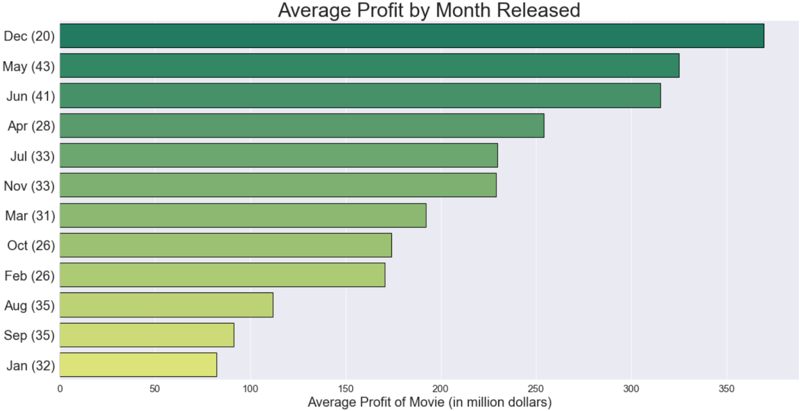
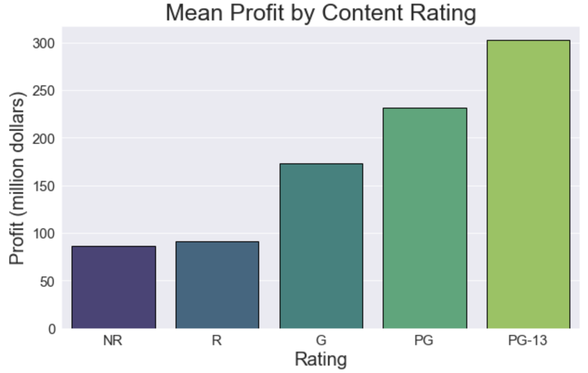
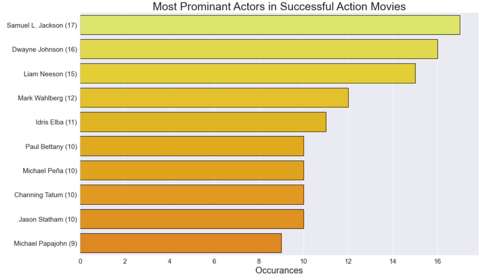

# Optimal Film Analysis for Microsoft
##### Authors: Will Cline, Killian Kahalley, Gabe Warner
***
## Overview
Descriptive analysis of movie databases reveals aspects of optimal film template to maximize likelihood of profitability for movies created in Microsoft’s film studio venture
***
## Business Problem
Microsoft wants to open up a new film studio. They have comissioned us to research what format of movie(s) will be most likely to be profitable, so that they can choose the right move to make.

### Though data comparisons like these...
Content rating and profit
Plotline tags of most profitable movies
Most frequent title elements
Average Movie profit when given actors are involved
Most Frequent runtimes for profitable movies
Production Budget and Total Profit

### We answer questions like:
What is a typical runtime for successful movies of our chosen genre?
What elements in an action movie are most likely to make it profitable and well-liked?
What words can we put in the title that sells a lot of tickets?
Is it overall more profitable to spend a lot of money on a few films or less money on a lot of films?
What content rating is likely to profit the most?
Which directors should we recruit for the film(s)?
Which actors should we recruit for the film(s)?
***
## Data
From a combined database of data from IMDB and The Numbers, we sourced 2287 movies to gather the bulk of our visualizations/conclusions. We narrowed this down to 359 successful action movies made between 1956 and 2019
Much of the data for our visualizations were created by keeping just "successful" movies in the data. We defined successful here as movies profiting at least 1 Million.
***
## Results
#### What is a typical runtime for successful movies?

***
#### When Should we Release it?

***
#### What words can we put in the title that sells a lot of tickets?

***
#### What content rating is likely to profit the most?

***
#### Which actors should we recruit for the film(s)?

***
#### Most common tags for successful action movies :

***
## Recommendations:

Content Rating: PG-13
Release in December

##### Sample Script:
##### Age of Alien: Fallen America
Begins with a conspiracy brewing from a white house insider (the President’s assistant). She helps her alien, spy boyfriend plan to assasinate the President of the United States. She does this by manipulating the POTUS into being alone without his secret service by having hot, passionate PG-13 sex with him.
After the Alien assassinates the president, he sends word back to the headquarters of his alien planet that the most powerful nation on Earth is now in disarray. The alien king sends in a fleet of alien warriors (who fly in on dragons) who wage war on Earth and destroy the planet.
After killing most of the humans, the aliens enslave the remaining survivors and generations go by. Many years later, a man is born into slavery with superhero strength and the ability to fly. The movie ends on a cliffhanger, with him realizing his superpowers at a young age.

##### Age of Alien: Super Guardian’s revenge 
The movie starts with the super boy leading an uprising against his alien oppressors. He becomes known as Super Guardian. To get back at Alien King, he goes to the alien planet with his friends from his slave encampment, and they go on a heist to steal all of the Alien King’s fancy stuff from the king’s chamber. Super Guardian even seduces Alien King’s wife and they have even more PG-13 sex. When Alien King gets wind of this, he’s pissed, so he tracks down Super Guardian and forces him to compete with him in an epic duel to the death in which the winner gets to be the undisputed ruler of the universe. Super Guardian wins the battle and gets a tattoo of Alien King on his arm so that he never forgets his humanity and to not let the evil that consumed the Alien King  consume him. 

##### Sample Cast:
POTUS: Liam Neeson \
POTUS assistant: Jennifer Lawrence \
Alien assassin:  Jason Statham \
Alien King: The Rock \
Super Guardian: Channing Tatum